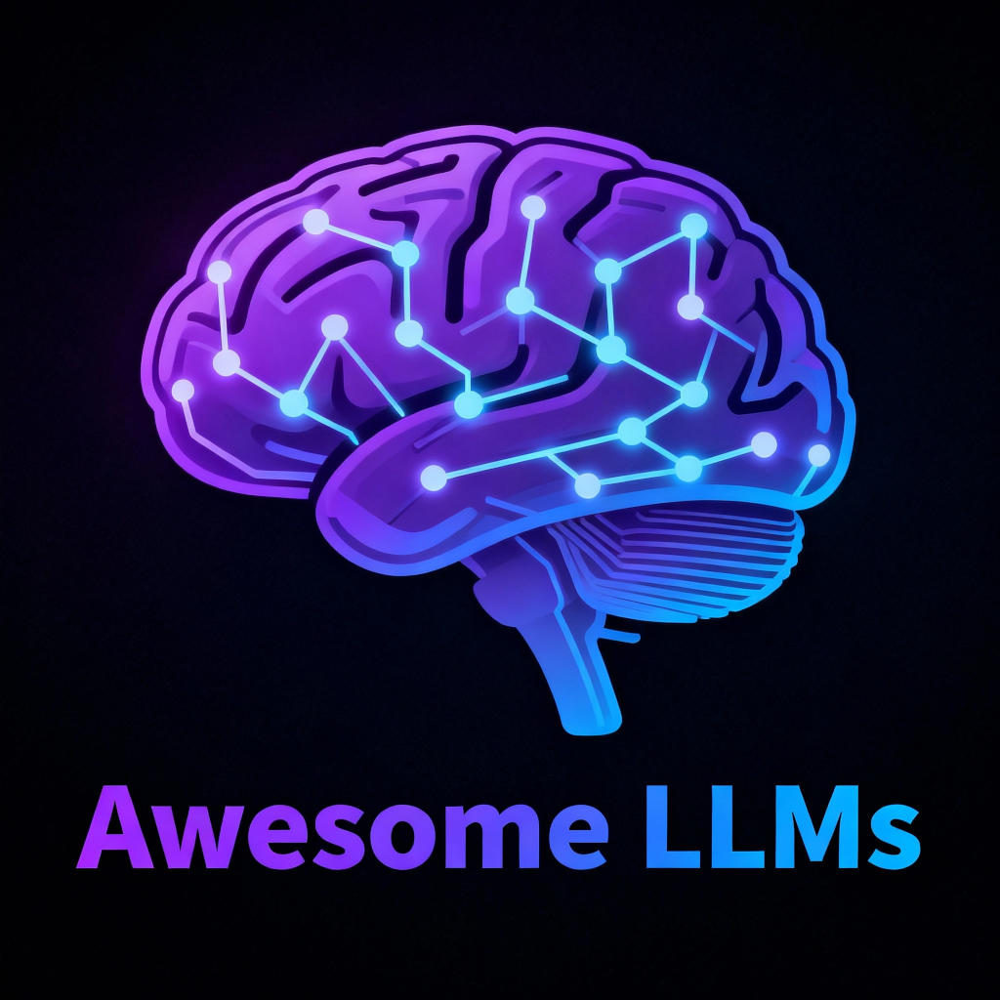

# Awesome LLMS

A curated collection of resources and information related to Large Language Models (LLMs), organized by topic and technology. This repository contains comprehensive text files detailing notable projects, tools, and guides in the LLM space.

## Contents

- **astro-llms-full.txt**: A compilation of LLM resources, projects, and developments in the Astro.js framework ecosystem.
- **golang-llms-full.txt**: A list of LLM tools, libraries, and solutions relevant to the Go (Golang) programming language.
- **qwik-qwikcity-llms-full.txt**: References and links for LLM integration and utilities within the Qwik and QwikCity frameworks.
- **webgl-llms-full.txt**: Information and projects connecting LLMs with WebGL technologies.
- **webgpu-llms-full.txt**: A collection of resources for running and optimizing LLMs using WebGPU.
- **htmx-llms-full.txt**: A full resource for HTMX.
- **typescript-llms-full.txt**: The complete TypeScript llms-full.txt.

Each `.txt` file contains handpicked links, libraries, guides, and overviews tailored to developers and enthusiasts working in these different technology stacks.

## License

See the [LICENSE](LICENSE) file for licensing details.
